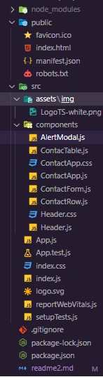

# Contact App

## Contenido el archivo

[Informacion general](#informacion-general)  
[Instalacion](#instalacion)  
[Configuracion](#configuracion)  
[Lenguajes de programacion](#lenguajes-de-programacion)  
[Estructura de carpetas](#estructura-de-carpetas)

## Informacion general

Contact App es una aplicacion sencilla pero efectiva para agregar, ver, editar, y eliminar los datos de una persona o cliente. Brinda
una interfaz minimalista y que permintira hacer cualquier operacion con pocos click.

## Instalacion

1. En la terminal, ve a una carpeta donde quieras que exista el proyecto. Escribir lo siguiente:  
   git clone https://github.com/gabrielceh/addressbook.git

2. Ir a la carpeta  
   cd addressbook

3. Instalar todas las dependencias necesarias para poder correr el proyecto. Lo haremos utilizando npm.  
   npm install

4. Una vez concluido, ejecutamos el servidor con el comando.  
   npm run start

## Configuracion

Antes de comenzar, instalar las siguientes librerias

- [uuid](https://www.npmjs.com/package/uuid)
- [bootstrap](https://getbootstrap.com/) mediante CDN

## Lenguajes de programacion

Se utiliza la libreria React para desarrollar la aplicacion. Esta es una libreria de JavaScript de codigo abierto.

## Estructura de carpetas

### 1. Carpeta public

En esta carpteta encontraremos el index.html, el manifest y el favico

### 2. Carpeta src

En esta carpeta encontraremos los archivos index.js, App.js, necesarios para el funcionamiento de la aplicacion, al igual que
varios archivos de test.  
Dentro de esta carpeta encontraremos tambien los siguientes folders:

#### assets

Contiene una carpete de ella llamada **img**, dentro de esta, se encuentran las imagenes del proyecto

#### components

Contiene todos los componentes de la aplicacion, al igual que sus archivos css si son necesarios.

